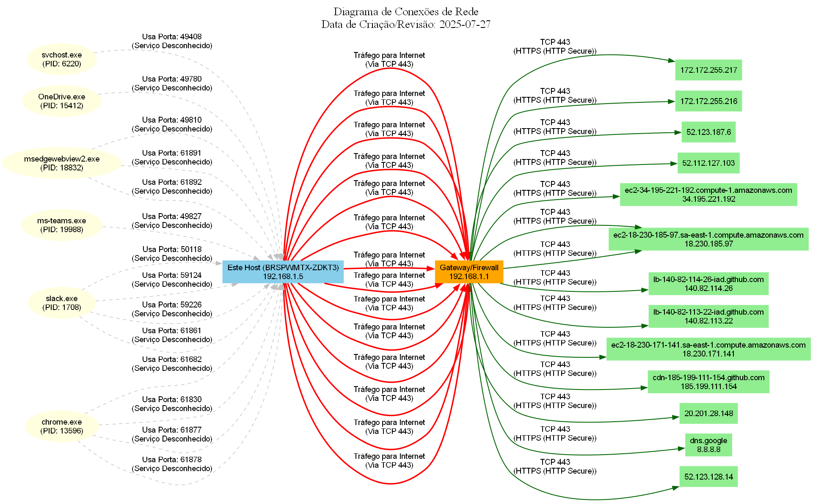

# Network Diagram Generator

Uma ferramenta em Python para detectar e visualizar conexões de rede ativas em hosts (Windows e Linux), correlacionando PIDs a nomes de processos e inferindo serviços/protocolos para gerar diagramas explicativos.

---

## Funcionalidades

* **Coleta de Dados Multiplataforma:** Coleta informações de conexão de rede usando `netstat -ano` (Windows) ou `ss -tunap` (Linux).
* **Mapeamento de Processos:** Associa PIDs a nomes e caminhos de executáveis utilizando a biblioteca `psutil`.
* **Inferência de Serviços/Protocolos:** Identifica serviços/protocolos comuns (HTTP, SSH, MySQL, etc.) com base nas portas utilizadas nas conexões.
* **Geração de Diagramas Visuais:** Cria diagramas de rede em formatos como PNG ou SVG, visualizando as conexões entre IPs, processos e destacando os serviços/protocolos ativos com a ferramenta Graphviz.

---

## Visão Geral e Como o Diagrama é Gerado

O script utiliza comandos específicos do sistema operacional (`netstat` no Windows ou `ss` no Linux/macOS) para coletar dados brutos de conexões de rede. Ele então processa esses dados, enriquecendo-os com informações de processo (PID, nome, caminho do executável) e os filtra com base em uma lista configurável de "portas de serviço de interesse" para focar no tráfego mais relevante para análise de segurança ou rede.

Finalmente, ele usa a biblioteca Graphviz para renderizar um grafo direcionado, que visualiza o fluxo de tráfego de forma intuitiva:

* **Processos (Elipses Amarelas)**: Representam aplicativos que estão realizando ou escutando conexões. Cada processo é rotulado com seu nome e PID.
* **IP do Host Local (Caixas Azuis Claras/Celestes)**: O endereço IP da sua máquina onde o script está sendo executado. Este nó é explicitamente identificado com o nome do seu host local (`Este Host (SeuNomeDeHost)`).
* **Gateway/Firewall (Caixa Laranja)**: O endereço IP do seu gateway de rede ou firewall, atuando como ponto de saída e entrada principal para a internet. É rotulado como `Gateway/Firewall`.
* **IPs Remotos (Caixas Verdes Claras)**: Endereços IP de hosts externos aos quais seu sistema está se conectando ou que estão se conectando a ele.
* **Arestas (Linhas de Conexão)**: Representam o fluxo de tráfego entre os nós, rotuladas com o protocolo, porta e nome do serviço (se conhecido).

    * **Processo -> IP Local (Linha Pontilhada Cinza)**: Indica que um processo está usando uma porta específica no IP local.
    * **IP Local -> Gateway (Linha Vermelha Sólida, mais grossa)**: Indica tráfego de saída do seu host para a internet, passando pelo gateway.
    * **Gateway -> IP Remoto (Linha Verde Escura Sólida)**: Representa o tráfego do gateway para um host externo.
    * **Conexões Locais Diretas (Linha Azul Sólida)**: Tráfego entre IPs dentro da sua própria sub-rede (excluindo o gateway).
    * **Porta LISTENING (Aresta Laranja Pontilhada sobre o IP Local)**: Indica que uma porta está aberta e escutando por conexões de entrada, esperando por um cliente.

---

## Exemplo de Diagrama de Rede

Aqui está um exemplo de um diagrama gerado pelo script. O diagrama real pode variar significativamente com base nas conexões ativas do seu sistema e nas suas configurações de rede.



* **Observação:** A identificação "Este Host (SeuNomeDeHost)" e "Gateway/Firewall" aparecem dinamicamente no diagrama gerado, tornando-o mais claro e personalizado.
* **Organização:** O arquivo da imagem (`network_diagram.png`) é armazenado na pasta `images/` dentro do repositório para uma melhor organização e exibição no GitHub.

---

# Por Que Um Bom Diagrama de Rede é Essencial?

Um diagrama de rede claro e atualizado é muito mais do que uma simples representação visual; ele é uma ferramenta estratégica crucial para a gestão e segurança de qualquer infraestrutura de TI. Ele pode ser essencial para:

* **Conhecimento Aprofundado da Rede:** Oferece uma visão instantânea e compreensível de como os componentes da sua rede estão interconectados, facilitando o entendimento de fluxos de dados e dependências.
* **Preparação e Conformidade em Auditorias:** É um ativo vital para demonstrar conformidade com normas e regulamentações (como PCI DSS, ISO 27001). Auditores frequentemente solicitam diagramas de rede para validar controles de segurança e entender a arquitetura.
* **Confirmação de Ausência de Mudanças Não Autorizadas:** Ao gerar diagramas periodicamente, você pode comparar versões e rapidamente identificar se houve a abertura de portas, novas conexões ou processos inesperados, agindo como uma evidência de controle de mudanças eficaz.
* **Evidência de Alterações na Rede:** Em caso de incidentes ou após implementações, um diagrama pode evidenciar exatamente onde e como as modificações ocorreram, facilitando a análise forense, a resolução de problemas e a comunicação entre equipes.
* **Suporte e Resolução de Problemas:** Ajuda equipes de suporte a diagnosticar problemas rapidamente, visualizando os caminhos de comunicação e identificando gargalos ou falhas de conexão.

Esta ferramenta visa automatizar a criação desses diagramas, transformando dados brutos de conexão em informações visuais acionáveis, fortalecendo sua postura de segurança e governança.

---

## Pré-requisitos

Para rodar este script, você precisará ter o Python e algumas bibliotecas e ferramentas adicionais instaladas.

1.  **Python 3.x:** (Versão 3.8 ou superior recomendada)
    * Verifique com `python --version` ou `python3 --version`.

2.  **Biblioteca Python `psutil`:**
    * Para mapear PIDs a processos.
    * Instalação: `pip install psutil`

3.  **Biblioteca Python `graphviz`:**
    * Interface Python para o software Graphviz.
    * Instalação: `pip install graphviz`

4.  **Software Graphviz:** (O motor de renderização de diagramas)
    * **Crucial:** O executável `dot` do Graphviz deve estar no `PATH` do seu sistema operacional.

---

## Como Instalar o Software Graphviz

### No Windows:

1.  Acesse o site oficial do Graphviz: [https://graphviz.org/download/](https://graphviz.org/download/)
2.  Baixe o instalador `.msi` mais recente para Windows (ex: `graphviz-X.XX.msi`).
3.  Execute o instalador. Durante o processo de instalação, **selecione a opção para adicionar o Graphviz ao `PATH` do sistema para todos os usuários**.
4.  Após a instalação, **reinicie seu terminal (Prompt de Comando ou PowerShell)**.
5.  **Verifique a instalação** executando no terminal:
    ```bash
    dot -V
    ```
    Se retornar a versão do Graphviz, a instalação está correta.

### No Linux (Ex: Ubuntu/Debian):

1.  Abra o terminal.
2.  Atualize os pacotes e instale o Graphviz:
    ```bash
    sudo apt update
    sudo apt install graphviz
    ```
3.  **Verifique a instalação** executando no terminal:
    ```bash
    dot -V
    ```
    Se retornar a versão do Graphviz, a instalação está correta.

---

## Como Usar

1.  **Clone o Repositório:**
    Abra seu terminal e clone este repositório:
    ```bash
    git clone https://github.com/salatcb-git/NetworkDiagramGenerator.git
    cd NetworkDiagramGenerator
    ```
2.  **Instale as Dependências Python:**
    Dentro da pasta `NetworkDiagramGenerator`, execute:
    ```bash
    pip install psutil graphviz
    ```
    *(Use `pip3` se `pip` não funcionar para Python 3.)*

3.  **Configure as Definições de Rede (Crucial!)**
    Abra o arquivo `network_diagram_generator.py` em um editor de texto e ajuste as seguintes variáveis no início do arquivo para corresponderem à sua rede:

    ```python
    # --- Configurações de Rede para o Diagrama ---
    # Ajuste estes valores para o seu ambiente
    LOCAL_HOST_IP_PREFIX = '192.168.1.' # O prefixo da sua sub-rede local (ex: '192.168.1.' para uma rede 192.168.1.0/24)
    GATEWAY_IP = '192.168.1.1'           # O endereço IP do seu gateway/roteador/firewall
    ```
    Você também pode personalizar a lista `SERVICE_PORTS_OF_INTEREST` para incluir ou excluir portas específicas que são relevantes para a sua análise.

4.  **Execute o Script:**
    No terminal, dentro da pasta do projeto, execute:
    ```bash
    python network_diagram_generator.py
    ```
    *(Ou `python3 network_diagram_generator.py` se `python` não funcionar.)*
    O script imprimirá no console as conexões encontradas e os passos da geração do diagrama.

5.  **Visualize o Diagrama e Adicione-o ao Git:**
    Após a execução bem-sucedida, um arquivo de imagem (`network_diagram.png` por padrão) será gerado na **mesma pasta do script**.

    Para que o diagrama seja exibido no seu `README.md` quando você visitar seu repositório Git (como no GitHub):

    a.  **Crie a pasta `images/` (se ainda não existir):**
        ```bash
        mkdir images
        ```
        *(Ou, se preferir via interface web do Git, crie um novo arquivo como `images/.gitkeep`.)*

    b.  **Mova o diagrama para a pasta `images/`:**
        ```bash
        mv network_diagram.png images/
        ```
        *(No Windows, use `move network_diagram.png images\`)*

    c.  **Adicione e commite as mudanças ao Git:**
        ```bash
        git add .
        git commit -m "Atualiza README e adiciona diagrama de rede gerado"
        git push origin main # Ou 'master', dependendo do nome da sua branch principal
        ```
    Após o `git push`, o diagrama será visível no seu `README.md` na plataforma do seu repositório.

---

## Contribuições

Contribuições são bem-vindas! Se você tiver ideias para melhorias ou encontrar algum bug, sinta-se à vontade para abrir uma *issue* ou enviar um *pull request*.

---

## Licença

Este projeto está licenciado sob a [MIT License](LICENSE).
